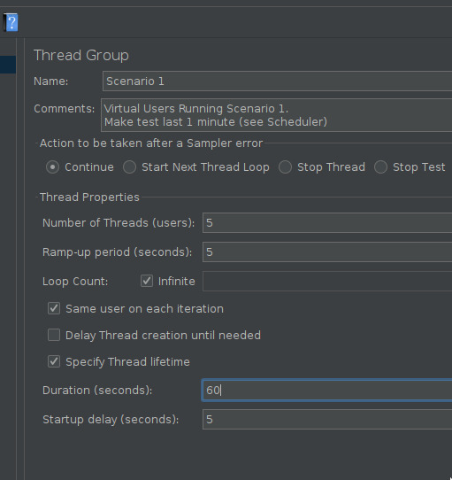
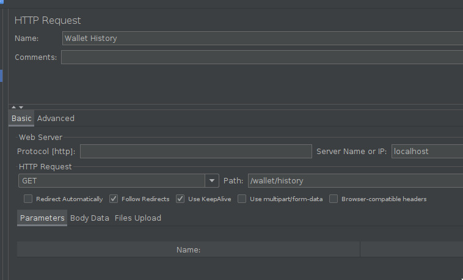
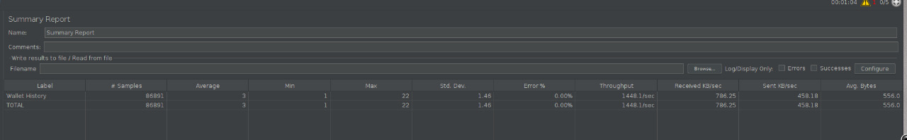
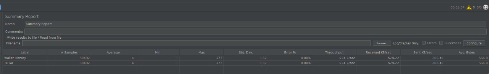
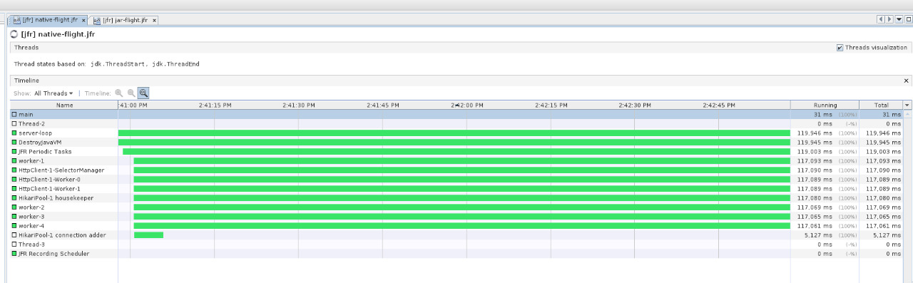
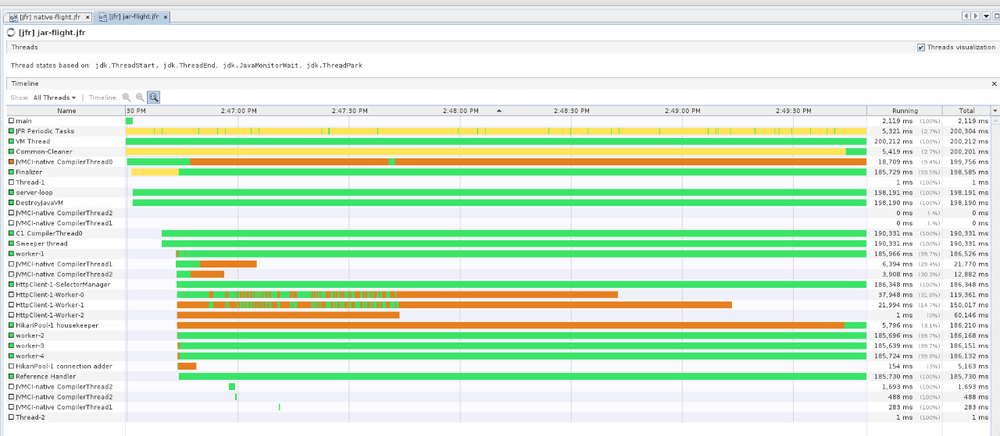

# Performance Comparison
You can download the test file I used here [assertion.jmx](docs/assertion.jmx) you will need [jmeter](https://jmeter.apache.org/) to execute/edit it.

This was the jmeter settings:  



The only change I did in the base code, was replace the http out for the crypto API to use a mocked http server in my machine.  
I used [moclojer](https://github.com/moclojer/moclojer) for the http server mock, with a basic default json response body for the [config](docs/moclojer.yml).

Acording to this [article](https://www.graalvm.org/22.0/reference-manual/native-image/JFR/) you can enable an limited, but functional 
JDK Flight Recorder in native-image compiled binaries adding the flag `-H:+AllowVMInspection` on compile time. 

With that was posible to take a jfr snapshot and read it on [VisualVM](https://visualvm.github.io/)

You can download the resulting test flights files that generate the prints bellow here:
 - [java](docs/jar-flight.jfr)
 - [native](docs/native-flight.jfr)

## Commands
```bash
# running the native bin
./target/service -XX:+FlightRecorder -XX:StartFlightRecording="filename=native-flight.jfr,dumponexit=true,duration=120s"

# running the jar
java -XX:+FlightRecorder -XX:StartFlightRecording=duration=200s,filename=jar-flight.jfr -jar target/service.jar
```

## Throughput
### Native

### Jar


## Threads
### Native

### Jar


